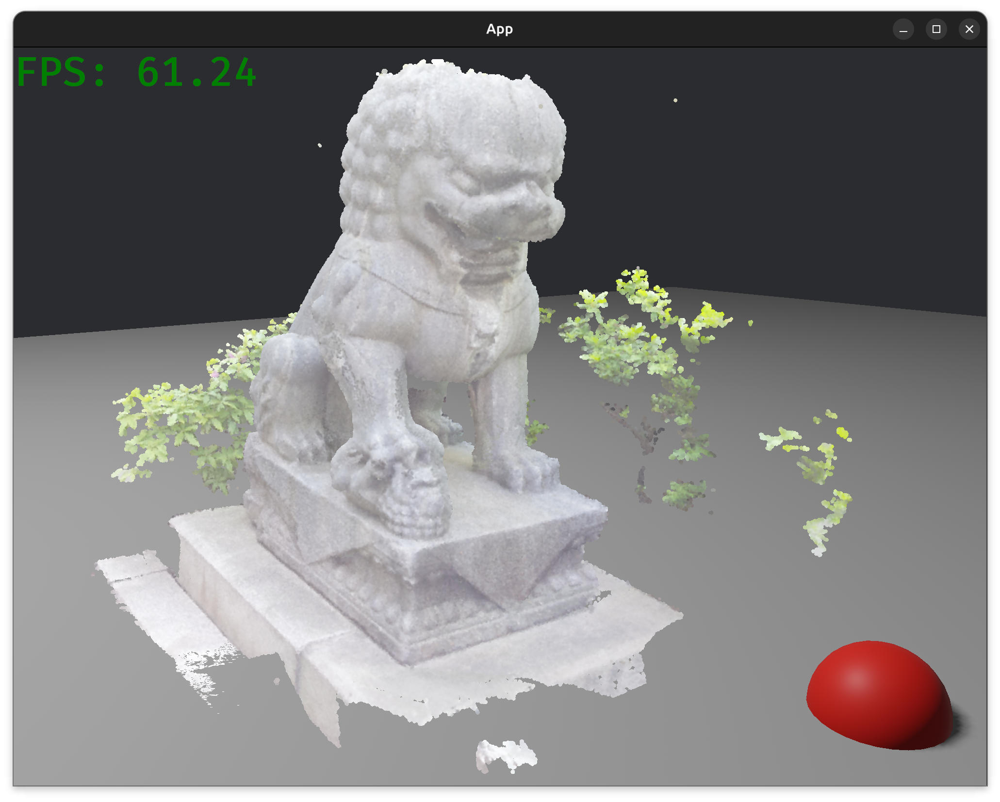
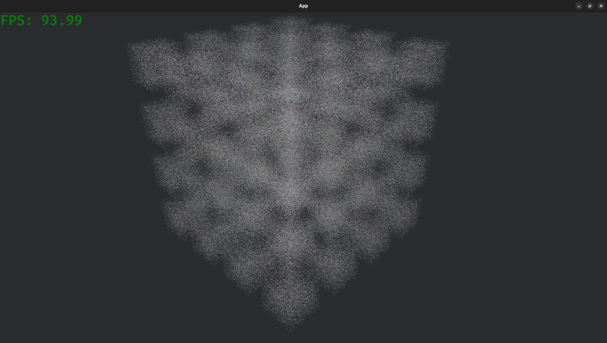
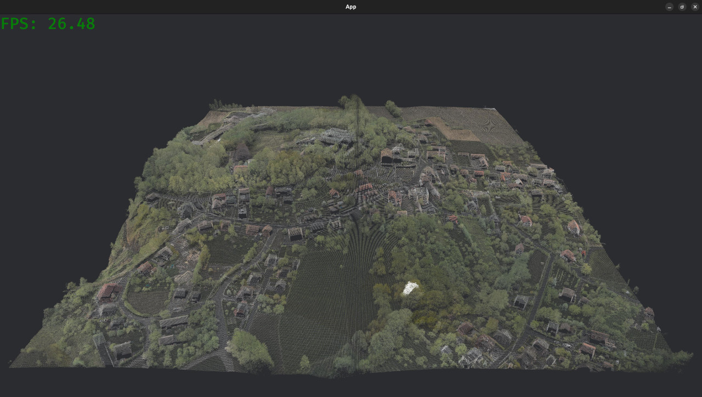

# Bevy Point Cloud

A Bevy plugin to render point clouds.

Roadmap :

- [x] Render point cloud using a shader
- [x] Compute AABB
- [ ] Add helpers for importing las/laz files 
- [ ] Add helpers for importing PLY files
- [ ] Implement rendering described in https://www.cg.tuwien.ac.at/research/publications/2016/SCHUETZ-2016-POT/SCHUETZ-2016-POT-thesis.pdf 
- [ ] Read Potree files in https://www.cg.tuwien.ac.at/research/publications/2016/SCHUETZ-2016-POT/SCHUETZ-2016-POT-thesis.pdf
- [ ] Efficiently load/unload chunks based on camera location
- [ ] ...

Takanawa Lion with multi pass rendering pipeline inspired by Potree:

1 million random points:

St. Anna Mountain, 33 millions points:

## Credits

- Rendering techniques and shaders adapted from [Potree](https://github.com/potree/potree)  
  Copyright (c) 2011-2020, Markus Schütz  
  Licensed under the BSD 2-Clause License (see THIRD_PARTY_LICENSES.md).

- Potree itself is based on prior research and open source projects.  
  Notably:
    - Multi-resolution octree algorithms developed at the Vienna University of Technology (Michael Wimmer, Claus Scheiblauer, Scanopy Project).
    - Shaders inspired by CloudCompare (EDL), plas.io (LAS/LAZ support), and other point cloud tools.

- The rendering pipeline implementation is based on Bevy's render pipelines  
  ([Bevy Engine](https://bevyengine.org), MIT or Apache-2.0).

## Acknowledgements

This project would not have been possible without the amazing work of the open-source
and research communities. In particular, I would like to acknowledge:

- [Potree](https://github.com/potree/potree) by Markus Schütz, which inspired the
  rendering techniques and some shader code used here.
- [Bevy Engine](https://bevyengine.org), whose rendering pipelines served as a
  foundation for the Rust-side implementation.
- The Vienna University of Technology (Michael Wimmer, Claus Scheiblauer) for their
  research on multi-resolution octrees in the [Scanopy Project](http://www.cg.tuwien.ac.at/research/projects/Scanopy/).
- [CloudCompare](http://www.danielgm.net/cc/) for the EDL shader approach.
- [plas.io](http://plas.io/) for early contributions to LAS/LAZ point cloud rendering.
- The broader open-source graphics and visualization community for their continuous
  contributions to point-based rendering.

Thank you to all the researchers, developers, and contributors whose work laid the
ground for this project.
